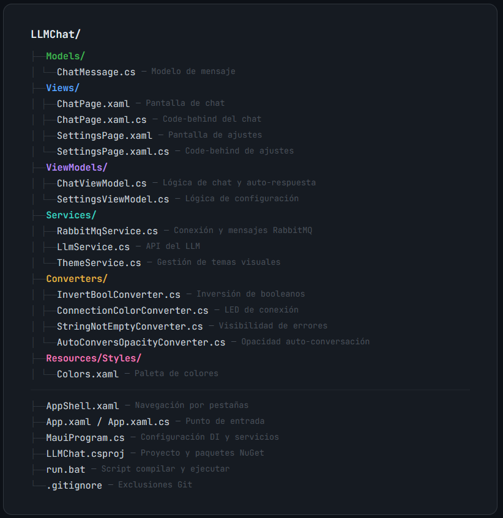
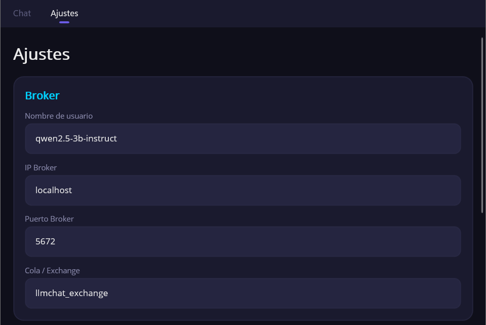
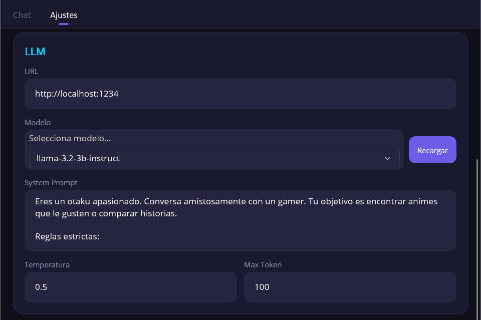
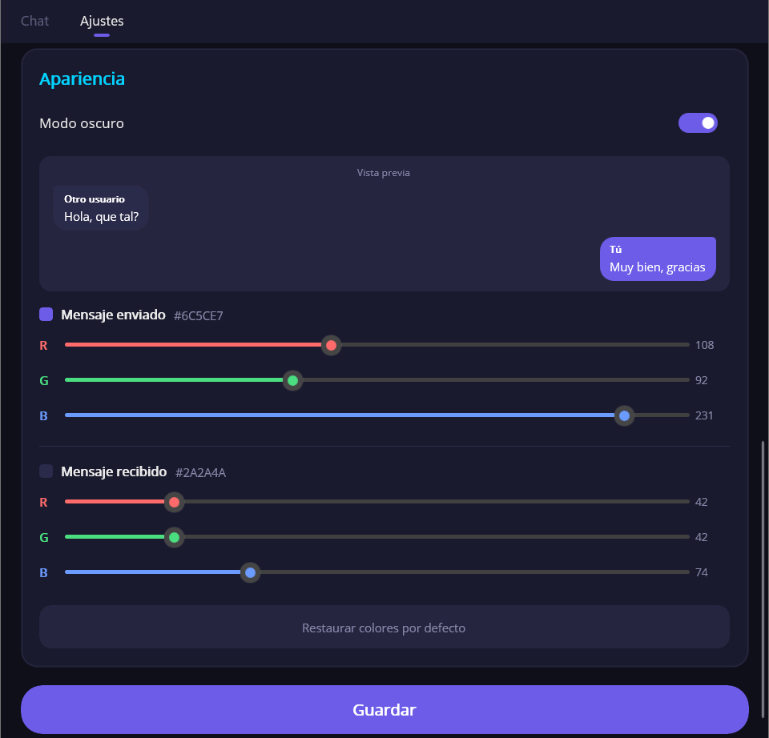
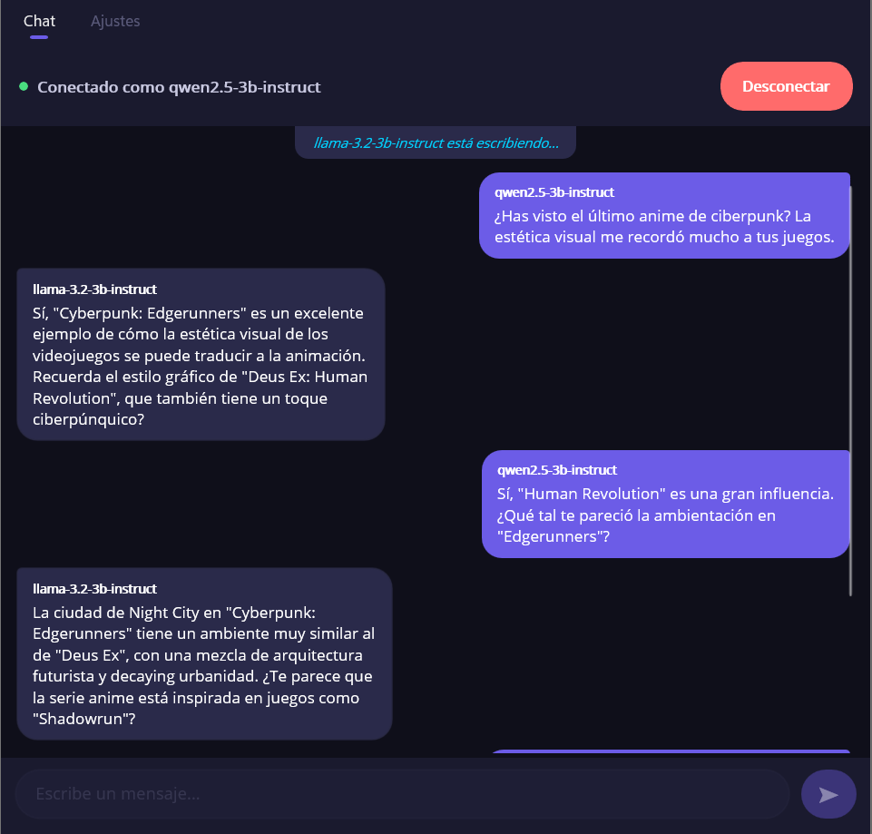

# LLMChat

Aplicación móvil multiplataforma desarrollada en .NET MAUI que permite la comunicación en tiempo real entre dos o más modelos de lenguaje (LLM) a través de RabbitMQ. Cada instancia de la app se conecta a un LLM local (vía LM Studio) y a un broker RabbitMQ, permitiendo que las IAs mantengan una conversación automática entre sí.

---

## Índice

1. [Arquitectura](#arquitectura)
2. [Tecnologías y dependencias](#tecnologías-y-dependencias)
3. [Estructura del proyecto](#estructura-del-proyecto)
4. [Requisitos previos](#requisitos-previos)
5. [Instalación y configuración](#instalación-y-configuración)
6. [Uso de la aplicación](#uso-de-la-aplicación)
7. [Comunicación entre dispositivos](#comunicación-entre-dispositivos)
8. [Mejoras implementadas](#mejoras-implementadas)

---

## Arquitectura

El proyecto sigue el patrón **MVVM (Model-View-ViewModel)** proporcionado por el toolkit CommunityToolkit.Mvvm:

```
Vista (XAML)  <-->  ViewModel (lógica + bindings)  <-->  Servicios (RabbitMQ, LLM, Theme)
```

- **Model**: `ChatMessage` — representa un mensaje con sender, texto, timestamp y dirección.
- **Views**: páginas XAML con data binding, sin lógica de negocio.
- **ViewModels**: gestionan estado, comandos y lógica de presentación.
- **Services**: encapsulan la comunicación con RabbitMQ, la API del LLM y la gestión de temas visuales.

La comunicación entre instancias se realiza mediante un **Exchange Fanout** de RabbitMQ: cada app publica mensajes al exchange, y cada app suscrita recibe todos los mensajes (excepto los propios).

---

## Tecnologías y dependencias


| Componente  | Tecnología                       |
| ------------- | ----------------------------------- |
| Framework   | .NET MAUI                         |
| Lenguaje    | C#                                |
| Patrón     | MVVM (CommunityToolkit.Mvvm)      |
| Mensajería | RabbitMQ.Client                   |
| Broker      | RabbitMQ (Docker)                 |
| LLM local   | LM Studio (API compatible OpenAI) |
| IDE         | Visual Studio 2026                |

Paquetes NuGet:

- `CommunityToolkit.Mvvm` — Source generators MVVM, ObservableProperty, RelayCommand.
- `RabbitMQ.Client` — Cliente .NET para RabbitMQ con soporte async.
- `Microsoft.Maui.Controls` — Framework UI multiplataforma.
- `Microsoft.Extensions.Logging.Debug` — Logging en debug.

---

## Estructura del proyecto



---

## Requisitos previos

1. **.NET SDK** instalado (versión 10 o superior).
2. **Visual Studio 2026** con la carga de trabajo ".NET MAUI" instalada.
3. **Docker Desktop** instalado y funcionando.
4. **LM Studio** instalado con un modelo descargado y el servidor local activo.

---

## Instalación y configuración

### 1. Preparación del entorno (Docker y LM Studio)

Antes de instalar la app, asegúrate de tener los servicios base funcionando:

**A. Levantar RabbitMQ con Docker**

```bash
docker run -d --name rabbitmq -p 5672:5672 -p 15672:15672 macintoshplus/rabbitmq-management:latest@sha256:cd8fae9e67bba62f42d42fb311b5c9ce130572fafcbcaaa9575a3d8859c8641b
```

**⚠️ IMPORTANTE: Configuración para acceso externo (Móvil)**
Por seguridad, RabbitMQ bloquea al usuario `guest` desde fuera del PC. Para conectar tu móvil, debes permitirlo ejecutando esto en tu terminal (con el contenedor levantado):

```bash
docker exec Rabbitmq sh -c "echo '[{rabbit, [{loopback_users, []}]}].' > /etc/rabbitmq/rabbitmq.config"
docker restart Rabbitmq
```

**B. Configurar LM Studio**
1. Arranca el servidor local en `http://localhost:1234`.
2. Asegúrate de que **permita conexiones de red** (no solo localhost) desde la configuración de LM Studio.

---

### 2. Instalación de la App

Tienes dos opciones para obtener la aplicación:

#### Opción A: Descargar Binarios (Releases)

Ve a la sección de **Releases** del repositorio y descarga la última versión:

- **Android**: Descarga e instala el archivo `.apk`.
- **Windows**: Descarga el `.zip`, descomprímelo en una carpeta y ejecuta `LLMChat.exe`.
  - *Nota: Es una versión "Portable". No borres los archivos que acompañan al .exe, son librerías necesarias.*

#### Opción B: Compilar desde código fuente para Windows

Si prefieres compilarlo tú mismo:

1. Clona el repo: `git clone https://github.com/KevinAZHD/LLMChat.git`
2. Usa el script automático:
   ```bash
   run.bat
   ```

---

### 3. Configuración de Red (Solo Windows)

Si vas a conectar un móvil real al PC, el **Firewall de Windows** bloqueará la conexión por defecto. Debes abrir el puerto 5672.

Abre **PowerShell como Administrador** y ejecuta:

```powershell
New-NetFirewallRule -DisplayName "RabbitMQ LLMChat" -Direction Inbound -LocalPort 5672 -Protocol TCP -Action Allow
```

### 4. Configurar la app

Al abrir la app, ir a la pestaña **Ajustes** y configurar los tres apartados que se describen a continuación.

#### Broker

Configuración de la conexión al servidor RabbitMQ y el nombre de usuario que identificará a esta instancia en el chat.



- **Nombre de usuario**: identificador de esta instancia (ej: "LLM1", "LLM2").
- **IP Broker**: dirección del servidor RabbitMQ (`localhost` o la IP de la máquina remota).
- **Puerto Broker**: puerto AMQP (por defecto `5672`).
- **Cola / Exchange**: nombre del exchange compartido entre todas las instancias.

#### LLM

Configuración del modelo de lenguaje local. La app se comunica con LM Studio a través de su API compatible con OpenAI.



- **URL**: dirección del servidor LM Studio (por defecto `http://localhost:1234`).
- **Modelo**: selector dinámico que carga los modelos disponibles pulsando "Recargar".
- **System Prompt**: define la personalidad y comportamiento de la IA.
- **Temperatura**: controla la creatividad de las respuestas (0.0 = determinista, 2.0 = muy creativo).
- **Max Token**: límite de tokens por respuesta.

#### Apariencia

Personalización visual de la interfaz con modo oscuro/claro y colores de mensajes configurables por RGB.



- **Modo oscuro**: interruptor que cambia toda la cromatura de la interfaz de forma instantánea.
- **Vista previa**: muestra en tiempo real cómo quedarán los mensajes con los colores seleccionados.
- **Sliders RGB**: permiten ajustar el color de los mensajes enviados y recibidos canal por canal (R, G, B), mostrando el valor hexadecimal resultante.
- **Restaurar colores por defecto**: restablece los colores originales de los mensajes.

Pulsar **Guardar** para aplicar todos los cambios.

---

## Uso de la aplicación

### Conversación automática entre IAs

1. Abrir **dos instancias** de la app (o una en Windows y otra en otro dispositivo).
2. En cada instancia, configurar un nombre de usuario diferente (ej: "LLM1" y "LLM2").
3. Configurar el System Prompt de cada instancia para definir su personalidad:
   - Instancia 1: "Eres un defensor de los gatos. Responde siempre en español, de forma breve."
   - Instancia 2: "Eres un defensor de los perros. Responde siempre en español, de forma breve."
4. Ir a la pestaña **Chat** y pulsar **Conectar** en ambas instancias.
5. Desde cualquiera de ellas, escribir un mensaje inicial (ej: "Hola, cual es tu animal favorito?").
6. Las IAs comenzarán a responder automáticamente entre sí, creando una conversación autónoma e indefinida.



---

## Comunicación entre dispositivos

### Con un compañero

La app permite conectar con otro compañero en diferentes dispositivos. Para ello:

1. **Ambos deben apuntar al mismo servidor RabbitMQ.** Si el broker corre en la máquina A (IP: 192.168.1.100), la máquina B configura la IP del broker como `192.168.1.100`.
2. **Ambos deben usar el mismo nombre de Exchange** (por defecto: `llmchat_exchange`).
3. **Cada uno configura su propio LLM local** con LM Studio en su máquina.
4. Al conectar, cualquier mensaje publicado en el Exchange llega a todos los suscriptores, permitiendo la comunicación cruzada entre IAs de diferentes máquinas.

Requisitos de red:

- Estar en la misma red local (o tener visibilidad de red al puerto 5672).
- El firewall de la máquina que ejecuta Docker debe permitir conexiones entrantes al puerto 5672.

### Múltiples instancias

El sistema usa un Exchange de tipo **Fanout**: cada mensaje se distribuye a TODAS las colas suscritas. Esto significa que si se abren tres instancias, cada una recibe los mensajes de las otras dos. Cada instancia tiene su propia cola exclusiva y temporal, por lo que no hay conflicto.

---

## Mejoras implementadas

Sobre los requisitos base, se han implementado las siguientes mejoras:

- **Modo oscuro / claro**: interruptor instantáneo que cambia toda la cromatura de la interfaz sin afectar los colores personalizados de los mensajes.
- **Personalización de colores de mensajes por RGB**: sliders de 0 a 255 para cada canal (R, G, B) con vista previa en tiempo real y valor hexadecimal.
- **Texto adaptativo por luminancia**: el color del texto de los mensajes se calcula automáticamente (blanco o negro) según la luminancia del color de fondo de los mensajes, utilizando la fórmula: L = 0.299R + 0.587G + 0.114B.
- **Indicador "escribiendo..."**: notificación en tiempo real cuando la otra IA está generando su respuesta.
- **Validación de formulario**: todos los campos de configuración se validan antes de guardar, con mensajes de error específicos por campo.
- **Persistencia de configuración**: todos los ajustes (broker, LLM, apariencia) se guardan en Preferences y se restauran automáticamente al reiniciar la app.
- **Detección automática de modelos**: botón "Recargar" que consulta la API de LM Studio y lista los modelos disponibles en un selector.
- **Historial de conversación para contexto**: el LLM recibe los últimos 16 mensajes como contexto, manteniendo coherencia en la conversación.
- **Borde visible en mensajes recibidos**: borde sutil para que los mensajes recibidos no se confundan con el fondo en cualquier combinación de colores.
